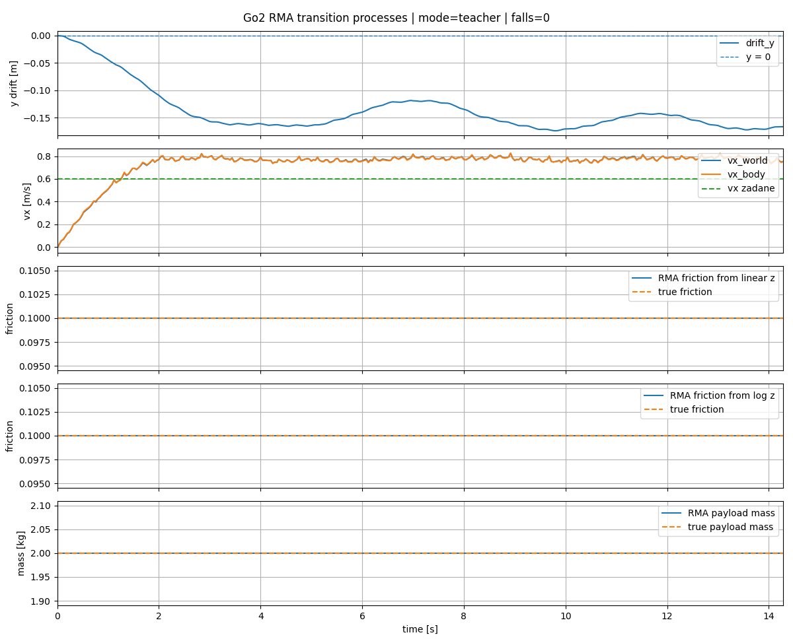
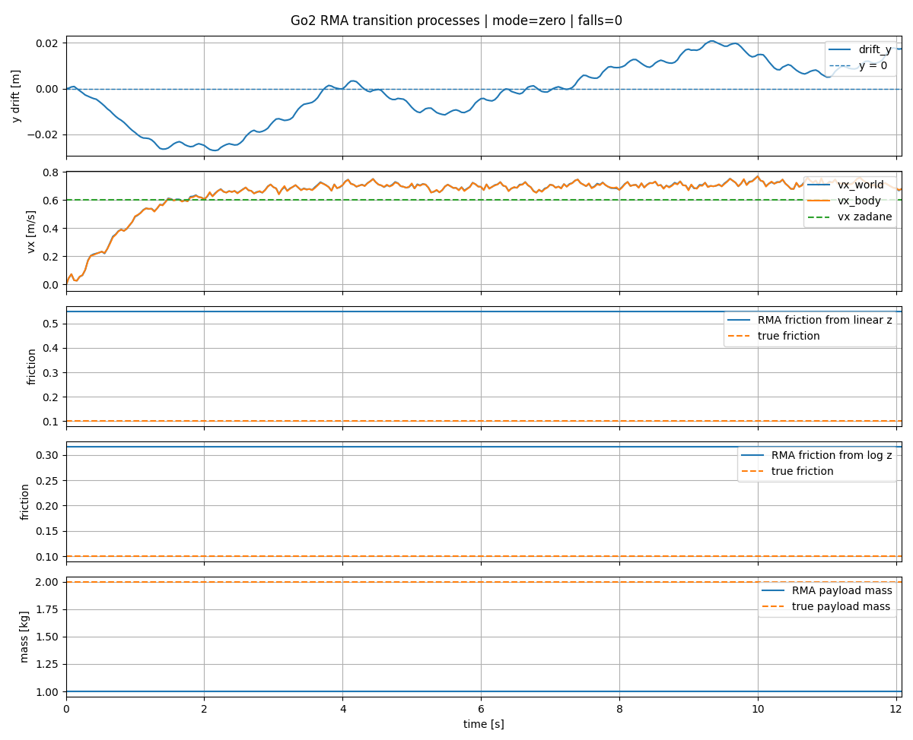
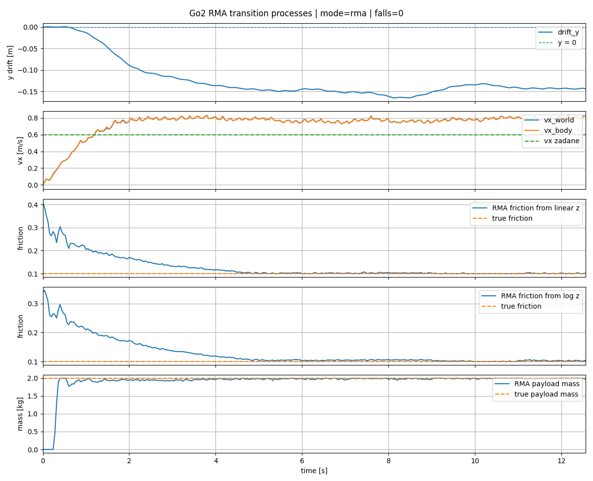

# Teoria sterowania w robotyce

## Opis projektu
Celem projektu jest implementacja i analiza algorytmu adaptacyjnego inspirowanego podejściem RMA (Rapid Motor Adaptation) dla robota kroczącego w środowisku symulacyjnym Genesis. Zadaniem modelu jest generowanie stabilnego ruchu robota w zmieniających się warunkach środowiskowych, takich jak różne wartości tarcia, śliskość podłoża oraz nierówności terenu.

W ramach projektu wytrenowano dwa komponenty: politykę sterującą ruchem robota oraz moduł adaptacyjny, który na podstawie historii stanów i akcji estymuje ukryty stan środowiska.

---

## Cele
- Implementacja polityki sterującej ruchem robota  
- Implementacja modułu adaptacyjnego  
- Trening modelu w środowisku Genesis  
- Porównanie działania modelu adaptacyjnego w różnych warunkach testowych.
---


## Instalacja środowiska

Projekt był przygotowany i testowany w systemie Linux. Do uruchomienia wymagany jest Python oraz dostęp do submodułów `genesis` i `rsl_rl`, ponieważ kod projektu korzysta z konkretnych wersji tych bibliotek.

Najpierw należy sklonować repozytorium razem z submodułami:

```bash
git clone --recurse-submodules https://github.com/krukich/TSwR.git
cd TSwR
```

Jeżeli repozytorium zostało już sklonowane bez submodułów, należy pobrać je osobno:

```bash
git submodule update --init --recursive
```

Następnie można uruchomić skrypt instalacyjny:

```bash
bash scripts/setup.sh
```

Skrypt tworzy środowisko wirtualne `.venv`, instaluje wymagane zależności oraz sprawdza dostępność submodułów i plików robota Go2.

Po zakończeniu instalacji środowisko należy aktywować poleceniem:

```bash
source .venv/bin/activate
```

Od tego momentu można uruchamiać skrypty treningowe i ewaluacyjne z katalogu projektu. Wytrenowane modele nie są przechowywane bezpośrednio w repozytorium, dlatego należy pobrać je osobno z Google Drive.

Gotowe komendy do uruchomienia poszczególnych eksperymentów znajdują się w opisach plików modeli na Google Drive.


## Wytrenowane modele

Wytrenowane modele nie są przechowywane bezpośrednio w repozytorium ze względu na rozmiar plików checkpointów. Wszystkie aktualne modele znajdują się w osobnym katalogu na Google Drive:

[Google Drive - wytrenowane modele](https://drive.google.com/drive/folders/1x3uDen8MqZw5EVCSddOEvBN7ynM8qbgJ?usp=drive_link)

W każdym katalogu konkretnego modelu, razem z plikami checkpointów, znajduje się plik `description.txt`, który zawiera krótki opis modelu, konfigurację treningu oraz zalecany sposób użycia.

---

## Architektura
Projekt składa się z dwóch głównych komponentów:

- **Base Policy (π)** – generuje akcje na podstawie aktualnego stanu robota  
- **Adaptation Module (φ)** – estymuje latent \(z_t\) na podstawie historii stanów i akcji  

---

## Opis plików

### Główne pliki projektu

- `src/go2_env.py` – główny plik środowiska symulacyjnego dla robota Unitree Go2. Definiuje dynamikę środowiska, obserwacje, akcje, nagrody, resetowanie epizodów oraz losowanie parametrów takich jak tarcie i masa dodatkowego obciążenia.

- `src/go2_train.py` – skrypt uruchamiający trening polityki sterującej w środowisku `Go2Env`. Zawiera konfigurację PPO, parametry środowiska, zakresy komend oraz ustawienia zapisu checkpointów.

- `src/go2_eval.py` – prosty skrypt ewaluacyjny do uruchomienia wytrenowanej polityki w jednym środowisku z wizualizacją. Pozwala sprawdzić zachowanie modelu dla wybranego checkpointu, prędkości zadanej i wysokości bazy.

- `src/go2_eval_friction.py` – rozszerzony skrypt testowy do oceny działania polityki w różnych warunkach tarcia i obciążenia. Zbiera podstawowe metryki, takie jak średnia prędkość, liczba upadków, długość epizodów oraz przyczyny resetu.

- `src/check.py` – pomocniczy skrypt diagnostyczny sprawdzający poprawność wczytania modelu Go2 oraz mapowania 12 sterowanych stawów. Używany głównie do szybkiej weryfikacji konfiguracji URDF i indeksów DOF.

### Konfiguracja i uruchamianie

- `scripts/setup.sh` – skrypt przygotowujący środowisko projektu. Tworzy środowisko `.venv`, instaluje zależności, inicjalizuje submoduły `genesis` i `rsl_rl` oraz sprawdza dostępność plików URDF robota Go2.

### Katalogi zewnętrzne
Katalogi `genesis/` oraz `rsl_rl/` są używane w projekcie jako submoduły, ponieważ kod środowiska i treningu został przygotowany pod konkretne wersje bibliotek Genesis oraz rsl_rl.
- `genesis/` – submoduł z symulatorem Genesis używanym do tworzenia środowiska fizycznego.
- `rsl_rl/` – submoduł z biblioteką reinforcement learning wykorzystywaną do treningu polityki PPO.

## Wyniki eksperymentów

W ramach projektu przeprowadzono eksperymenty z uczeniem 
polityki sterującej dla robota Unitree Go2 w symulatorze 
Genesis oraz z testowaniem jej odporności na zmienne warunki 
środowiskowe. Główna polityka była trenowana metodą PPO z 
wykorzystaniem biblioteki `rsl_rl`, a robot był sterowany w 
trybie pozycyjnym dla 12 stawów.

Pierwszym etapem było wytrenowanie polityki bazowej, która 
otrzymywała obserwacje proprioceptywne robota oraz informacje 
o zadanej prędkości ruchu. Po treningu robot nauczył się 
stabilnego chodu do przodu i był w stanie utrzymywać równowagę
przy standardowych ustawieniach środowiska. Następnie wykonano testy generalizacji dla różnych wartości 
tarcia podłoża oraz dodatkowej masy umieszczonej na robocie.

Ostatnim etapem było przygotowanie modułu adaptacyjnego 
inspirowanego podejściem RMA. Moduł ten uczył się estymować 
ukryte parametry środowiska na podstawie historii obserwacji i 
akcji robota, dzięki czemu polityka nie musi bezpośrednio 
otrzymywać informacji uprzywilejowanych podczas działania.

### Tryb teacher, tarcie 0.1

Tryb `teacher` oznacza wariant testowy, w którym polityka otrzymuje prawdziwe wartości obserwacji uprzywilejowanych, czyli rzeczywiste parametry środowiska, takie jak tarcie podłoża i masa dodatkowego obciążenia. Jest to tryb referencyjny, ponieważ model nie musi estymować tych wartości na podstawie historii ruchu robota.

Testy przeprowadzono dla bardzo niskiej wartości tarcia podłoża równej `0.1` z dodatkowym obciążeniem `2 kg`. W takich warunkach robot utrzymał stabilny ruch przez cały epizod i nie odnotowano żadnego upadku (`falls = 0`).

Na wykresie widać, że prędkość w osi `x` szybko dochodzi do zadanej wartości `0.6 m/s`, a następnie utrzymuje się powyżej celu. Jednocześnie pojawia się niewielki dryf boczny w osi `y`, co jest oczekiwanym efektem przy tak niskim tarciu, ale nie prowadzi on do utraty stabilności.

Wartości tarcia oraz masy na wykresach parametrów uprzywilejowanych pozostają zgodne z rzeczywistą konfiguracją eksperymentu. Wynik ten pokazuje, że przy dostępie do prawdziwych parametrów środowiska polityka potrafi poprawnie poruszać się nawet na śliskim podłożu.



### Tryb zero, tarcie 0.1

Tryb `zero` oznacza wariant testowy, w którym polityka nie otrzymuje prawdziwych wartości obserwacji uprzywilejowanych ani estymacji z modułu adaptacyjnego. Zamiast tego część obserwacji odpowiadająca parametrom środowiska jest ustawiana na wartości zerowe, dlatego tryb ten służy jako prosty punkt odniesienia pokazujący, jak polityka zachowuje się bez poprawnej informacji o tarciu i obciążeniu.

Testy przeprowadzono dla bardzo niskiej wartości tarcia podłoża równej `0.1` z dodatkowym obciążeniem `2 kg`. Mimo braku poprawnych parametrów środowiska robot utrzymał stabilny ruch przez cały epizod i nie odnotowano żadnego upadku (`falls = 0`).

Na wykresie widać, że prędkość w osi `x` szybko przekracza 
wartość zadaną `0.6 m/s` i przez większość testu utrzymuje 
się w zakresie około `0.7 m/s`. Na wykresie dryfu bocznego widać, że robot najpierw odchyla się w jedną stronę, a następnie koryguje ruch i przechodzi na przeciwną stronę osi `y`. Różni się to od trybu `teacher`, gdzie po początkowym odchyleniu robot dalej poruszał się już bardziej stabilnie w jednym kierunku. Oznacza to, że bez prawdziwych wartości obserwacji uprzywilejowanych polityka nadal utrzymuje równowagę, ale korekcja kierunku ruchu jest mniej płynna.

Wykresy parametrów pokazują jednak dużą rozbieżność między wartościami używanymi przez model a rzeczywistymi warunkami testu. Model działa tak, jakby tarcie i masa obciążenia miały wartości nominalne, podczas gdy rzeczywiste tarcie wynosi `0.1`, a masa dodatkowa `2 kg`. Wynik pokazuje, że sama polityka bazowa jest dość odporna, ale tryb `zero` nie odzwierciedla rzeczywistych parametrów środowiska.



### Tryb RMA, tarcie 0.1

Tryb RMA oznacza wariant testowy, w którym polityka nie otrzymuje bezpośrednio prawdziwych wartości obserwacji uprzywilejowanych. Zamiast tego moduł adaptacyjny estymuje ukryte parametry środowiska, takie jak tarcie podłoża i masa dodatkowego obciążenia, na podstawie historii obserwacji oraz akcji robota.

Testy przeprowadzono dla bardzo niskiej wartości tarcia podłoża równej 0.1 z dodatkowym obciążeniem 2 kg. W tych warunkach robot utrzymał stabilny ruch przez cały epizod i nie odnotowano żadnego upadku (falls = 0).

Na wykresie widać, że prędkość w osi x szybko przekracza wartość zadaną 0.6 m/s, a następnie utrzymuje się powyżej celu, podobnie jak w pozostałych trybach. Dryf boczny w osi y jest zauważalny: robot odchyla się w jedną stronę i tylko częściowo koryguje tor ruchu, ale nie prowadzi to do utraty stabilności.

Najważniejszą różnicą względem trybu zero są wykresy estymowanych parametrów. Moduł RMA początkowo zawyża wartość tarcia, ale po kilku sekundach estymacja zbliża się do rzeczywistego tarcia 0.1. Estymacja masy również szybko dochodzi do wartości bliskiej rzeczywistemu obciążeniu 2 kg. Oznacza to, że moduł adaptacyjny poprawnie rozpoznaje zmienione warunki środowiska i dostarcza polityce informacje zbliżone do obserwacji uprzywilejowanych z trybu teacher.



### Końcowy wynik
Najważniejszy wynik eksperymentu polega na tym, że moduł RMA poprawnie zbliża estymowane tarcie do wartości 0.1 oraz estymowaną masę do 2 kg. Dzięki temu polityka może działać w sposób bardziej świadomy niż w trybie zero, bez konieczności podawania jej prawdziwych obserwacji uprzywilejowanych jak w trybie teacher.

Moduł RMA był testowany w zakresie różnych parametrów środowiska, obejmujących tarcie podłoża od 0.1 do 1.0 oraz dodatkowe obciążenie robota od 0 do 2 kg. W przeprowadzonych eksperymentach estymacje nie były idealne od pierwszego kroku, ale zazwyczaj w krótkim czasie stabilizowały się w pobliżu rzeczywistych wartości. Pokazuje to, że moduł adaptacyjny potrafi reagować na różne warunki środowiskowe.


## Bibliografia
- RMA: Rapid Motor Adaptation for Legged Robots  
  https://arxiv.org/pdf/2107.04034

---

## Zespół
- Artsiom Kruk 
- Daniil Kavalevich
